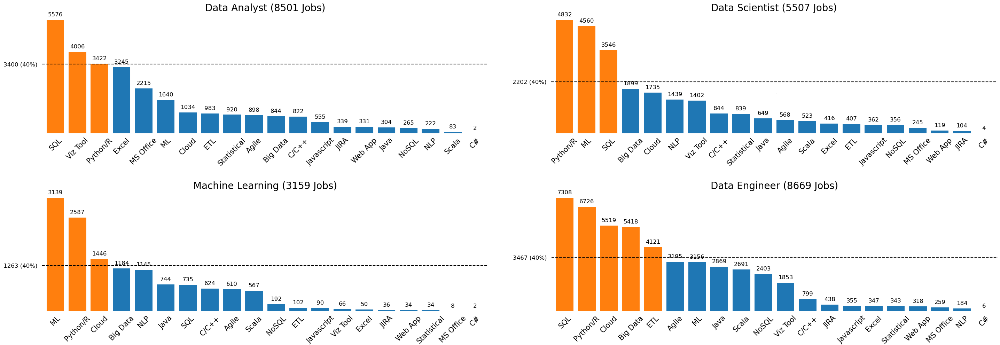
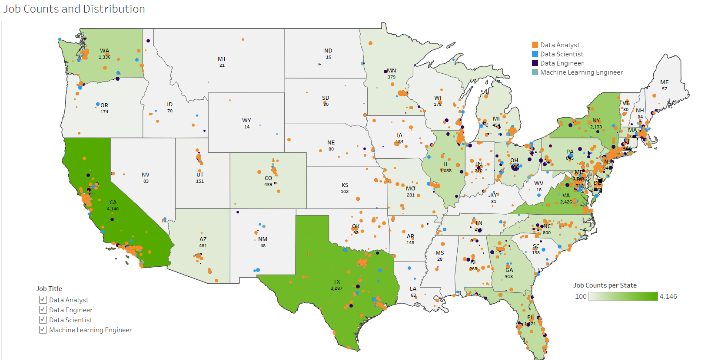
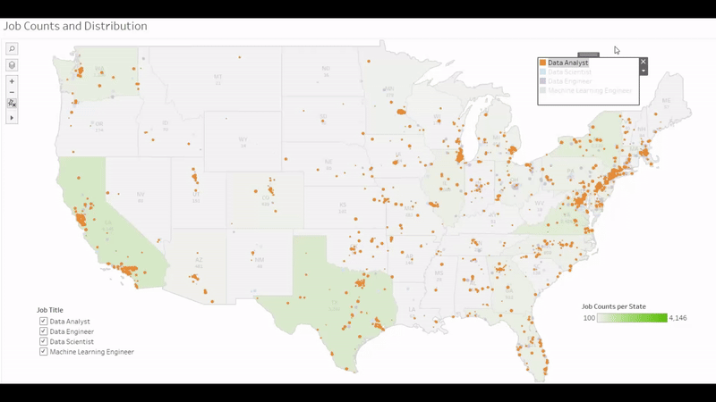
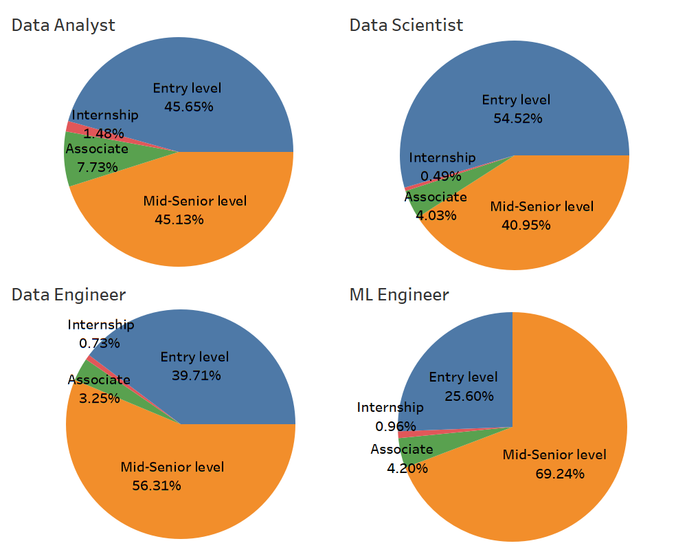
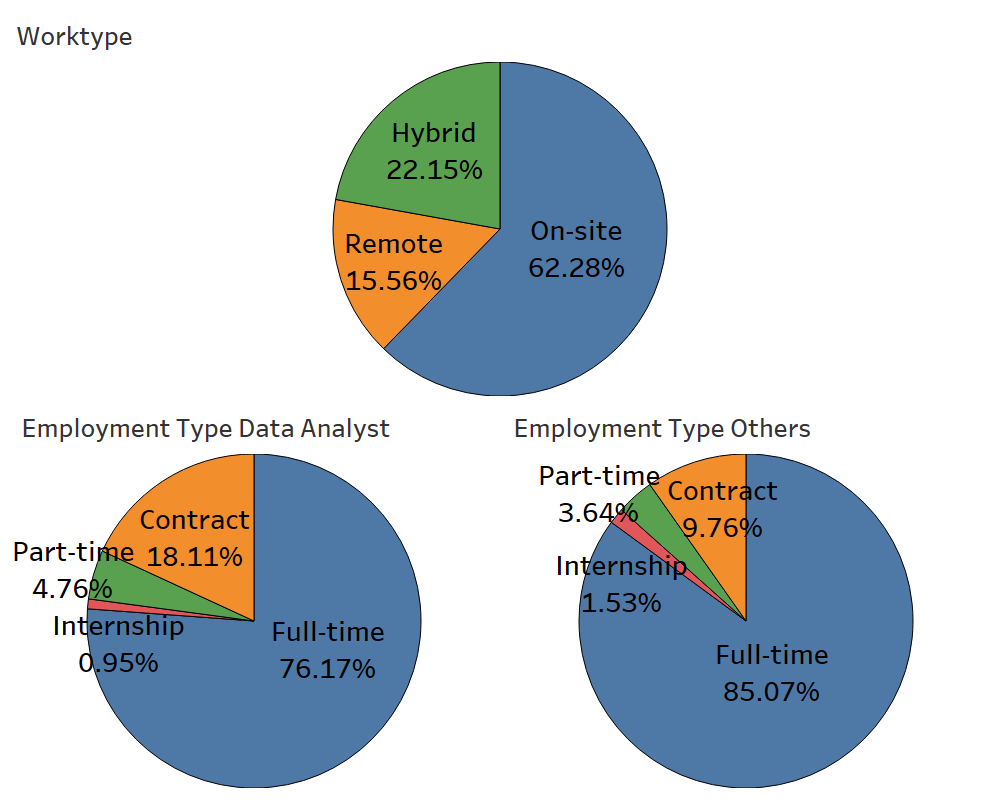
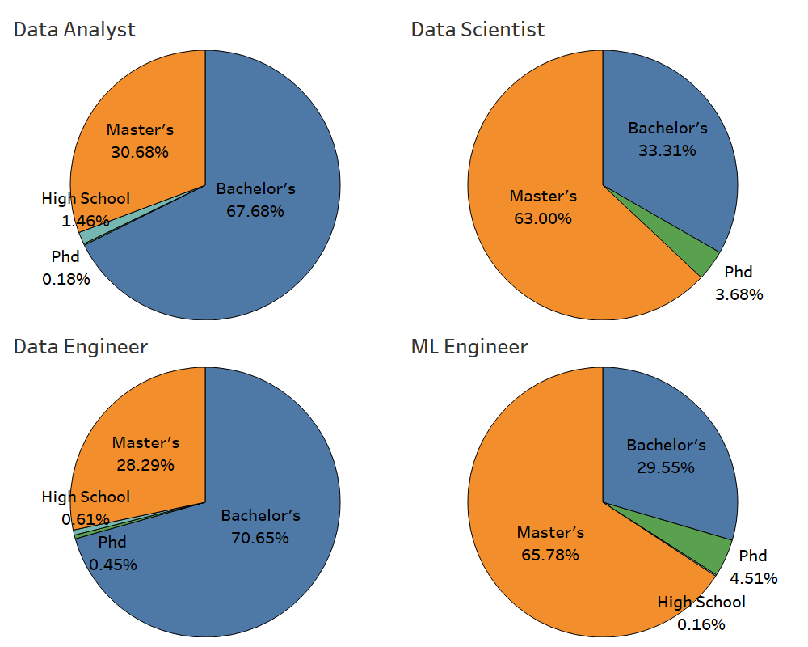

# ***Data Analyst Job Market Analysis***  

## ***Introduction***
The project aims to assist individuals in landing their first job as data professionals. The main objectives are pinpointing essential skills for various positions and analyzing job characteristics such as location, educational requirements, and work types. The project includes four parts:
- Extracted job listings from LinkedIn for April and May 2024 using the search terms 'Data Analyst,' 'Data Scientist,' 'Data Engineer,' and 'Business Analyst.'
- Explored, cleansed, and normalized data.
- Used predefined skill sets, including clearance and academic qualifications, and natural language processing (NLP) techniques to identify and binary encode them from job descriptions.
- Visualized key findings with maps, bar charts, and pie charts.  

## ***Summary***
Contrary to expectations, over 200,000 job listings searching by 'data analyst' and related keywords yielded about 40,000 'Software Engineer' positions and only 14,000 'Data Analyst/Scientist' positions. We will focus on the roles of 'Data Analyst,' 'Data Scientist,' 'Machine Learning Engineer,' and 'Data Engineer.' Below is the word cloud representing all roles and the pie chart depicting four specific roles.

    

   

    

 

### ***1. Skills:*** 

When a skill is mentioned in over 40% of job descriptions for a particular role, it is deemed critical for that position. The chart indicates that SQL and Python/R skills are highly demanded, making certifications and related projects a worthwhile investment. Additionally, the chart provides further insights: 

- Data Analyst: The job involves retrieving data using SQL, followed by cleaning and analyzing the data through various methods, primarily using SQL, visualization tools, and occasionally Python or R. The final step is to visualize and present the data insights to stakeholders. 
- Data Scientist and ML Engineer: The main responsibility of these roles is to develop machine learning models. The key difference is that Data Scientists are still deeply involved in gathering and preprocessing data (SQL is heavily required), while Machine Learning Engineers work in a downstream role, using data that has already been processed.
- Data Engineer: The position also includes extracting and cleaning data with SQL and Python. However, the processed data is not for presenting data insights or developing machine learning models (no "Viz Tool" or "ML"). Given the emphasis on "Big Data" and "ETL," the job focuses on maintaining, transforming, and building pipelines for massive data sets. 

  

To get the chart above, we quantify the skills needed for a job and assign "1" to a skill if specific keywords are present in the job description; otherwise, "0". Below are keywords for different skills: 

- Python/R: Python, R, and their libraries.
- SQL: Words include SQL but not NoSQL, relational database, Amazon RDS, Google BigQuery, and IBM Db2.
- Viz Tool: Tableau, Power BI, and Qlik.
- ML: Words include machine learning, deep learning, AI, ML, scikit learn, and NLP.
- Cloud: Words include cloud computing, Amazon Web Service (AWS, EC2, S3, RDS, DynamoDB, Lambda, Redshift), Microsoft Azure, Google Cloud (BigQuery), IBM Cloud, Oracle Cloud, and Salesforce Cloud.
- Big Data: Words include big data, large scale data, Hadoop, Apache Spark, Kafka, Databrick, terabyte, and petabyte.
- ETL: Words include ETL (extract, transform, and load), data warehouse, and data lake.  

### ***2. Job Opportunities:*** 

California and Texas lead in job opportunities, each offering over 3000 positions, while Virginia, New York, Washington, Florida, Illinois, and Maryland each provide over 1000 jobs. The majority of employment is clustered in these eight states. Conversely, half of the states offer fewer than 200 jobs, and two-thirds provide fewer than 500. The maps below show the job opportunity distribution throughout the United States.

 
 
### ***3. Seniority:*** 

Approximately half of the Data Analyst and Data Scientist positions are labeled as entry-level. Conversely, roles such as Data Engineer and Machine Learning Engineer are generally more advanced, with 56% and 70% requiring mid-senior-level experience. It is important to note that many job descriptions labeled "entry-level" often seek candidates with two to three years of experience.

    

 

### ***4. Work and Employment Type:*** 

The pie charts illustrate the distribution of work and employment types. They show that approximately 80% of positions are full-time, and notably, Data Analysts have around 20% contract roles, which is twice as much as in other positions. 

    

  

### ***5. Degree:*** 

The charts below illustrate the highest degree required in job descriptions (counting only "Master's" if both "Master's" and "Bachelor's" are mentioned). While roles in Data Analyst and Data Engineer require a 70% Bachelor's degree, Data Scientist and Machine Learning Engineer positions tend to demand a Master's degree, with a 65%. Moreover, approximately 4.5% of Machine Learning Engineer roles demand a PhD, the highest proportion among the others, highlighting the need for advanced theoretical knowledge in this field.

    

  

## ***Language and Software***
- Jupyter Lab 4.2.0
- Python 3.12.3
- Python Library: requests, BeautifulSoup, numpy, pandas, regex, nltk, matplotlib, seaborn, wordCloud, sklearn
- Tableau 2024.1
