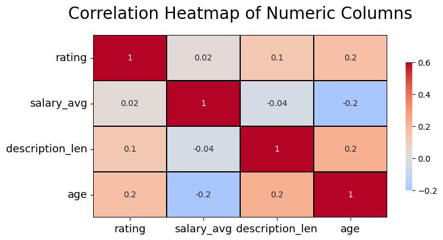
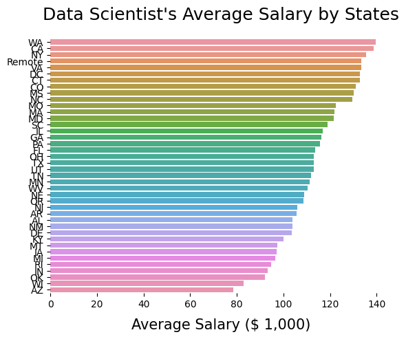

# Data Scientist Salary Estimator

## Project Goal
Created a tool that estimated data scientist salaries to help users negotiate their income when they get a job.

## What's in the Project
- Scraped over 1000 jobs from Glassdoor using Python and Selenium.
- Cleaned data and engineered features from the job title and job description, quantifying these data as job positions, seniorities, and required skills.
- Performed exploratory data analysis(EDA) and visualized the findings.
- Optimized Linear, Lasso, and Random Forest Regression using GridSearchCV to reach the best model.
- Built a client-facing API using Flask.

## Code and Resources Used
Python Version: 3.8  
Packages: selenium, numpy, pandas, sklearn, re, matplotlib, seaborn, nltk, wordcloud, flask, json, pickle

Glassdoor Scraper Article: [Selenium Tutorial: Scraping Glassdoor.com in 10 Minutes](https://mersakarya.medium.com/selenium-tutorial-scraping-glassdoor-com-in-10-minutes-3d0915c6d905)  
Glassdoor Scraper Github: [Selenium Tutorial: Scraping Glassdoor.com](https://github.com/arapfaik/scraping-glassdoor-selenium)  
Flask Productionize: [Productionize a Machine Learning model with Flask and Heroku](https://towardsdatascience.com/productionize-a-machine-learning-model-with-flask-and-heroku-8201260503d2)  
Youtube Project Walk-Through: [Data Science Project From Scratch](https://www.youtube.com/playlist?list=PL2zq7klxX5ASFejJj80ob9ZAnBHdz5O1t)

## Web Scraping
The Glassdoor scraper was from 2019, and part of the code is outdated. I Updated and modified the scraper to scrape job postings from Glassdoor.com. With each job posting, we scraped the following:
- Job Title
- Estimated Salary
- Job Description
- Company Rating
- Company Name
- Job Location
- Company Size
- Comapny Founded Year
- Type of Ownership
- Industry
- Sector
- Revenue

## Data Cleaning
Cleaned the collected data for eda and model. Following changes were made and new variables created:
- Removed duplicated rows and renamed columns.
- Created a new column seniority from job title. Seniorities are decided by the keyword in job title.
- Simplified job titles.
- Remove rows without salary.
- Parsed numeric data out of salary.
- Created a new column description_len for the length of job description.
- Created new columns for skills that mentioned in the job description:
  - Big Data(Spark or Hadoop)
  - Cloud(AWS or Azure)
  - Excel
  - ML(Machine Learning or Deep Learning)
  - RPython(R or Python)
  - SQL
  - Viztool(Tableau or PowerBI)
- Parsed the state abbreviation out of location.
- Transformed company founded year into the age of comapny.

## EDA
Explored the distributions, value counts, pivot tables, etc. of the data. Below are some highlights from visualizations.

     
     
     

     

