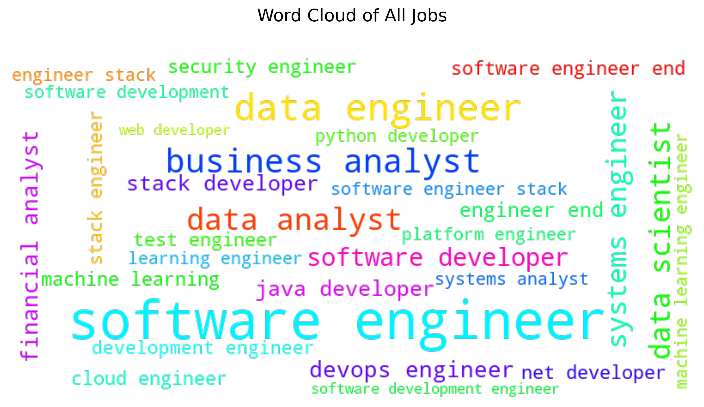
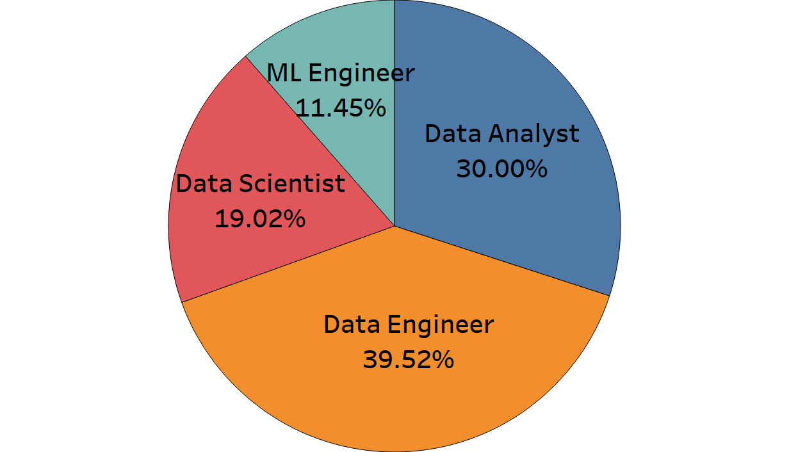
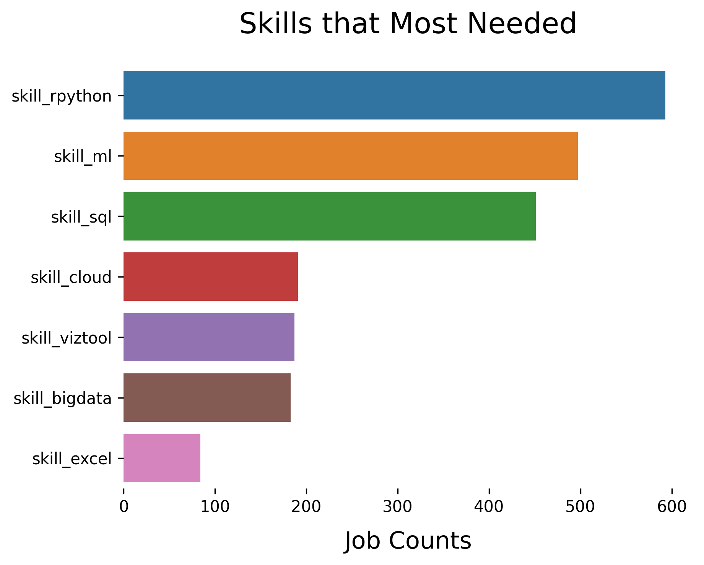
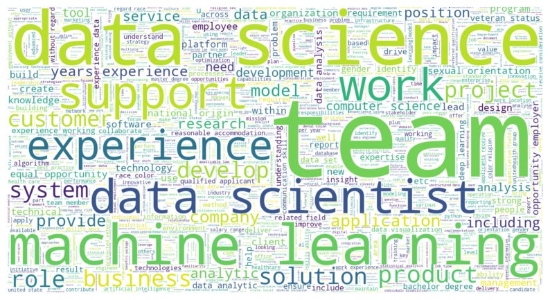
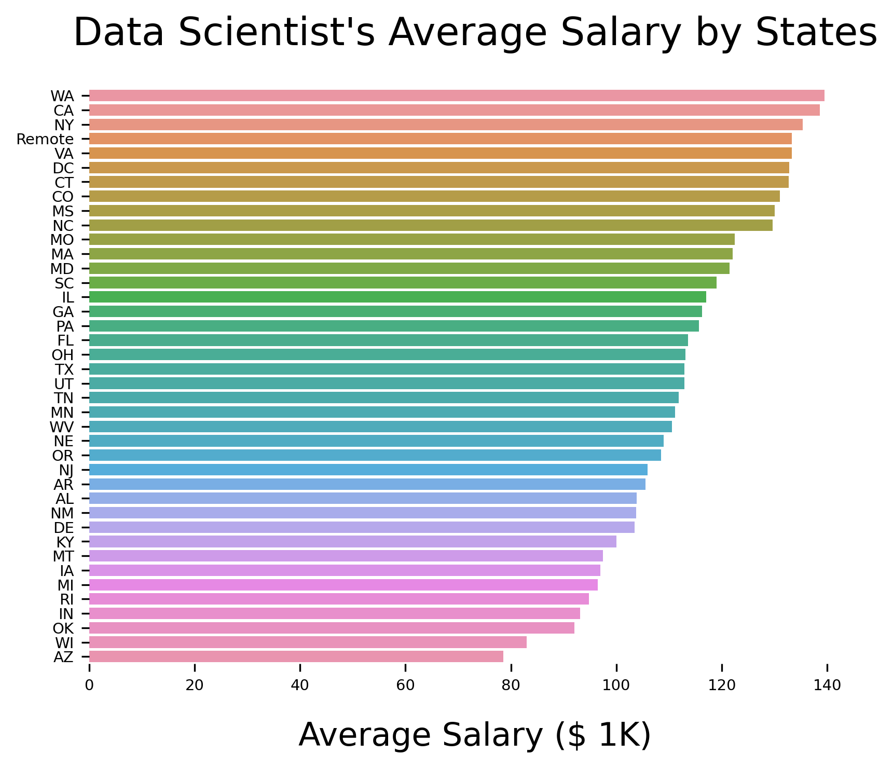
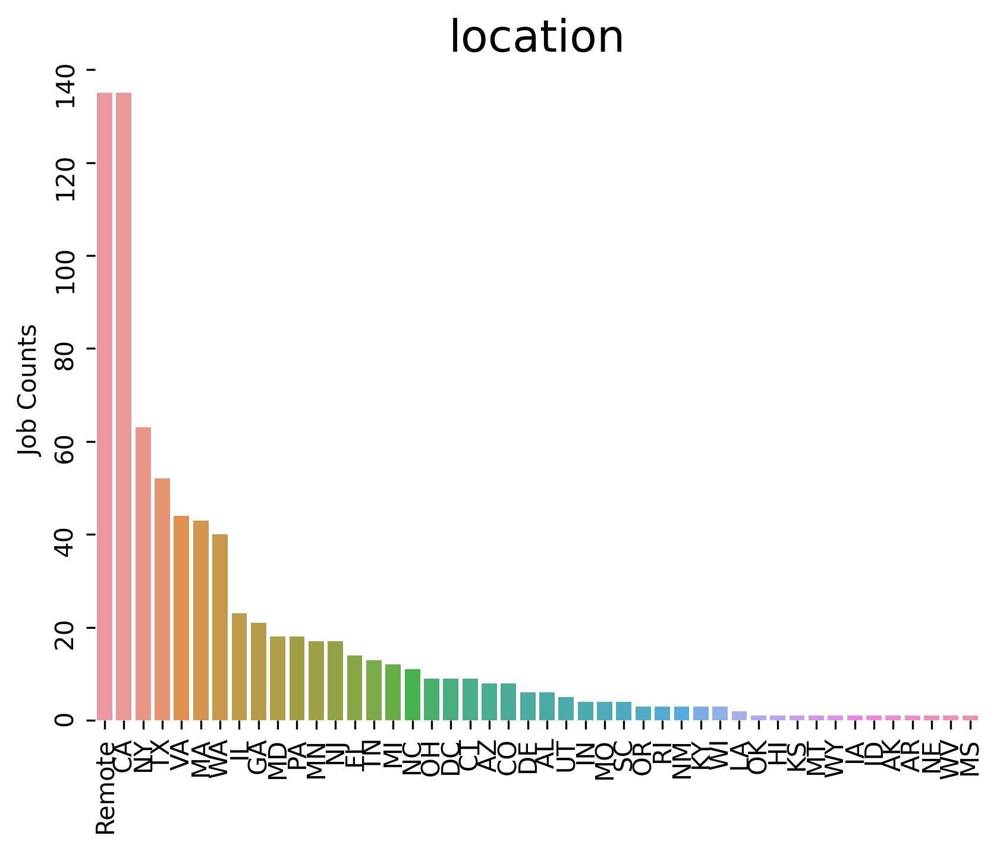
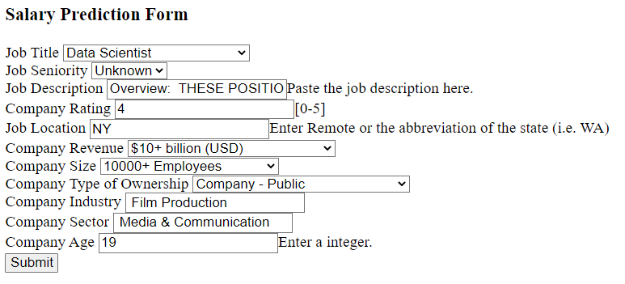

# ***Data Analyst Job Market Analysis***  

## ***Introduction***
The project aims to assist individuals in landing their first job as data professionals. The main objectives are pinpointing essential skills for various positions and analyzing job characteristics such as location, educational requirements, and work types. The project includes four parts:
- Extracted job listings from LinkedIn for April and May 2024 using the search terms 'Data Analyst,' 'Data Scientist,' 'Data Engineer,' and 'Business Analyst.'
- Explored, cleansed, and normalized data.
- Used predefined skill sets, including clearance and academic qualifications, and natural language processing (NLP) techniques to identify and binary encode them from job descriptions.
- Visualized key findings with maps, bar charts, and pie charts. 

## ***Summary***
Contrary to expectations, over 200,000 job listings searching by 'data analyst' and related keywords yielded about 40,000 'Software Engineer' positions and only 14,000 'Data Analyst/Scientist' positions. We will focus on the roles of 'Data Analyst,' 'Data Scientist,' 'Machine Learning Engineer,' and 'Data Engineer.' Below is the word cloud representing all roles and the pie chart depicting four specific roles.

    

   

**1. Top 3 In-Demand Skills for Employers:  **
Most companies require candidates to possess technical skills like R/Python, SQL, machine learning, big data (Spark or Hadoop), cloud platforms (AWS or Azure), Excel, and data visualization tools (Tableau or Power BI). These skills were extracted from the 'Qualifications' section of job descriptions and categorized accordingly.

    

    

**2. Common keywords in job descriptions:  **
Identified top job description keywords using the Natural Language Toolkit (NLTK) and created a word cloud. Using these keywords in the resume can enhance compatibility with applicant tracking systems (ATS).

 
    

  
 
**3. Average Salaries in Different States:  **
The average salary for a data scientist varied from $80,000 to $140,000 across different states. Notably, Washington, California, and New York offered the highest salaries.

    

   

**4. Job Opening Distribution Across States:  **
Remote and California led in job openings, with more than double the number of openings compared to the third-ranked state, New York. 

    

  

## ***Language and Software***
Python 3.12.3
Tableau Desktop 2024.1.2 

## ***Project Overview***
This project aimed to enhance my prospects of securing a data analyst/scientist role by comprehensively understanding the job market. I achieved this by scraping and analyzing job listings from platforms like Glassdoor using Selenium. The primary objectives were:
- Identified in-demand skills highly sought after by employers.
- Extracted crucial keywords to enhance resume quality and effectiveness.
- Examined average salary benchmarks, categorized by job titles and geographical regions.
- Evaluated job opening distribution across various states.

## Code and Resources Used
Python Version: 3.8  
Packages: selenium, numpy, pandas, sklearn, re, matplotlib, seaborn, nltk, wordcloud, flask, json, pickle

Glassdoor Scraper Article: [Selenium Tutorial: Scraping Glassdoor.com in 10 Minutes](https://mersakarya.medium.com/selenium-tutorial-scraping-glassdoor-com-in-10-minutes-3d0915c6d905)  
Glassdoor Scraper Github: [Selenium Tutorial: Scraping Glassdoor.com](https://github.com/arapfaik/scraping-glassdoor-selenium)  
Flask Productionize: [Productionize a Machine Learning model with Flask and Heroku](https://towardsdatascience.com/productionize-a-machine-learning-model-with-flask-and-heroku-8201260503d2)  
Youtube Project Walk-Through: [Data Science Project From Scratch](https://www.youtube.com/playlist?list=PL2zq7klxX5ASFejJj80ob9ZAnBHdz5O1t)

## Web Scraping
The Glassdoor scraper was from 2019, and part of the code is outdated. I Updated and modified the scraper to scrape job postings from Glassdoor.com. With each job posting, we scraped the following:
- Job Title
- Estimated Salary
- Job Description
- Company Rating
- Company Name
- Job Location
- Company Size
- Comapny Founded Year
- Type of Ownership
- Industry
- Sector
- Revenue

## Data Cleaning
Other than fixing or removing incorrect, corrupted, incorrectly formatted, duplicate, or incomplete data within a dataset, we also made the following changes:
- According to the keyword in the job title, created a seniority column that classified jobs into three categories: Low, High, and Unknown.
- Simplified job titles to six categories: Data Analyst, Data Scientist, Data Engineer, ML Engineer, Manager, and Others.
- Created a description_len column for the length of the job description.
- Created six skill columns which having 1 if that specific skill is mentioned in the job description and 0 otherwise:
  - Big Data(Spark or Hadoop)
  - Cloud(AWS or Azure)
  - Excel
  - ML(Machine Learning or Deep Learning)
  - RPython(R or Python)
  - SQL
  - Viztool(Tableau or PowerBI)
Transformed the company founded year into the age of the company.
    

## Model Building
First, encoded categorical columns using pd.get_dummies. Then, split the data into 80% training set and 20% test set. Finally, built three models and evaluated them using Mean Absolte Error(MAE). Three models are:
- Linear Regression: MAE = $22.25K
- Lasso Regression: MAE = $20.67K
- Random Forest Regression: MAE = $19.27K

## Productionize
Built a flask API endpoint that was hosted on a local webserver. The API endpoint takes in user inputs and returns an estimated salary.

    
    
    

