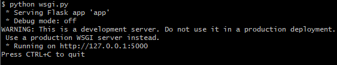
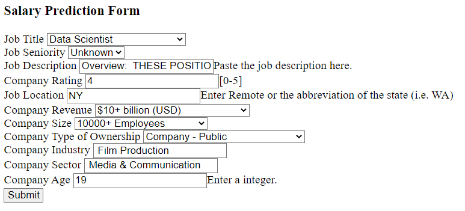

# Create a FLASK API
Navigate to the main directory  
`cd ~/.../main`  

Create a folder to store the app  
`mkdir flask`  

Navigate to the new folder  
`cd flask`  

Create a virtual environment  
`python3 -m venv vir_env`  

Activate the virtual environment  
`source vir_env/Scripts/activate`  

Install all the packages we’ll need  
`pip3 install flask pandas sklearn`  

Save a list of packages and versions that production will need to install  
`pip3 freeze > requirements.txt`  

Create new files  
`touch app.py`  
`touch Procfile`  
`touch wsgi.py`  
`mkdir models`  
`mkdir templates`  

Move the pickle file `model_file.p` into `models` file. Store html files in `templates` file. 

# Run the app
Run the command:  
`python wsgi.py`  

And you'll see this:  
  

It shows the application is running locally on the URL http://127.0.0.1:5000. Navigate to the URL in the browser and an user-input form will show up.  
  

